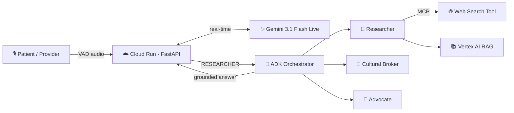

<div align="center">

# ⚕️ Zero Gravity Agent

### The first real-time medical interpreter that doesn't just translate — it *protects*.

**A net-new, autonomous medical interpreting agent.** Sub-second Spanish ⇄ English interpretation
that intervenes *before* it speaks — catching ambiguity, folk-illness, and life-threatening errors
the way a certified human interpreter would.

`Gemini 3.1 Flash Live` · `ADK Multi-Agent` · `MCP` · `Vertex AI RAG` · `Cloud Run`

[**🔴 Live Demo**](https://zero-gravity-agent-780640579358.us-central1.run.app) · [Architecture](docs/ARCHITECTURE.md) · Google AI Agents Challenge — **Track 1: Build**

</div>

---

## The problem worth solving

In US hospitals, **40%+ of Spanish-speaking patients** face a language barrier in care. When a patient
says *"soy alérgico a la penicilina"* and it's mistranslated — **people die.** Human medical interpreters
are scarce, expensive, and cognitively exhausted. Generic AI "translators" make it worse: they translate
word salad literally, miss cultural illness terms, and go silent under pressure.

**A translator converts words. An *interpreter* protects meaning.** Zero Gravity is the interpreter.

---

## What makes it different — the "states of being"

Zero Gravity is not a chatbot wrapper. It runs a live **semaphore of agent states**, switching in real time:

| State | When | What it does |
|-------|------|--------------|
| 🟢 **CONDUIT** | 90% of the time | Faithful, first-person, sub-second interpretation |
| 🟡 **CLARIFIER** | Ambiguity / incoherent speech | Asks **before** translating (two-phase). Flags word-salad as a clinical sign |
| 🟣 **CULTURAL BROKER** | Folk illness (*susto, empacho, mal de ojo*) | Brokers the cultural concept into a clinical equivalent |
| 🔬 **RESEARCHER** | Rare term / unknown idiom | Consults a **multi-agent reasoning team** (see below) |
| 🚨 **ADVOCATE** | Allergy conflict, dose confusion, self-harm | Interrupts to prevent harm in real time |

> It catches a penicillin-allergy conflict, mid-conversation, and stops the line. That's the product.

---

## Architecture — a hybrid multi-agent system

Real-time **voice** stays on Gemini Live. Heavy **reasoning** runs on an ADK multi-agent layer that
reaches the open internet via **MCP** and grounds answers in **Vertex AI RAG**.



Full diagram & request lifecycle → [`docs/ARCHITECTURE.md`](docs/ARCHITECTURE.md)

---

## Mandatory technologies (Track 1 compliance)

| Pillar | Technology |
|--------|-----------|
| **Intelligence** | Gemini 3.1 Flash Live (audio) + Gemini 2.5 Flash (reasoning) |
| **Orchestration** | **Agent Development Kit (ADK)** — orchestrator + 3 specialist agents |
| **External tools (MCP)** | **Model Context Protocol** server for live web search → RAG fallback |
| **Grounding** | Vertex AI RAG Engine (`zero-gravity-knowledge-base`) |
| **Infrastructure** | Google Cloud Run (containerized) |
| **Identity** | Google OAuth SSO |

---

## Run it locally

```bash
pip install -r requirements.txt
# Drop your Vertex service-account JSON in the project root (auto-detected)
# Set GEMINI_API_KEY_LLC in .env
python main.py            # → http://localhost:8000
```

Press the mic **once** → speak Spanish → pause → it interprets and keeps listening. No hold-to-talk.

---

## Testing access (for judges)

- **Live URL:** https://zero-gravity-agent-780640579358.us-central1.run.app
- **Login Bypass:** Append your Judge Token as a query parameter (see Devpost submission instructions).
- In-app **🎭 Demo → 🚦 Trigger Test** runs 8 clinical scenarios and auto-grades the agent's state switching (✅/❌).

---

## Project structure

```
zero gravity agent/
├── main.py            # FastAPI + WebSocket — real-time orchestration
├── semaphore.py       # Agent-state routing (the "states of being")
├── state_manager.py   # In-RAM clinical memory (HIPAA — no PHI storage)
├── adk_agents.py      # ADK multi-agent reasoning layer (Orchestrator + 3 specialists)
├── mcp_server.py      # MCP server — external web-search tool
├── rag_engine.py      # Vertex AI RAG connector (ADC / key-file)
├── config_loader.py   # Bulletproof dynamic config (clamped, hot-reload)
├── config.json        # Tunable VAD / timeouts / triggers — no code edits
├── static/index.html  # Responsive frontend (VAD worklet, semaphore HUD, scratchpad)
├── docs/              # Architecture, research, evaluation battery
└── assets/            # Screenshots & demo recordings
```

---

## Engineering highlights

- **Two-phase intervention** — never translates ambiguous content "just in case"; clarifies first.
- **Smart VAD** — detects the natural interpreter pause ("1-2-3 GO"), not a fixed timer.
- **Anti-hallucination memory** — deterministic capture of allergies, symptoms, meds, interventions.
- **Bulletproof config** — out-of-range values are clamped, never crash; tune live without redeploy.
- **Graceful degradation everywhere** — MCP → RAG → professional judgment. Nothing hard-fails.

---

<div align="center">

**Zero Gravity. Because in medicine, every word is a life.**

© 2026 SingularityOS AI — Proprietary. See [LICENSE](LICENSE).

</div>
