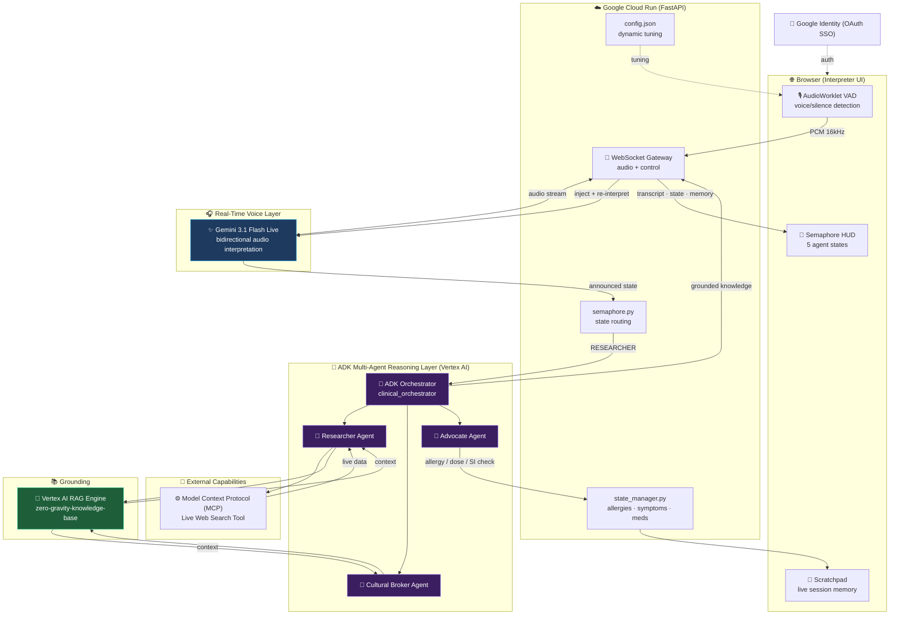

# 🏗️ Zero Gravity Agent — Architecture

**A hybrid multi-agent system for HIPAA-compliant real-time medical interpretation.**
Built for the Google for Startups AI Agents Challenge — Track 1 (Build).

---

## System Diagram

---

## Mandatory Technologies (Track 1 compliance)

| Pillar | Technology | Where |
|--------|-----------|-------|
| **Intelligence** | Gemini 3.1 Flash Live + Gemini 2.5 Flash | Real-time audio + ADK reasoning |
| **Orchestration** | Agent Development Kit (ADK) | Multi-agent reasoning layer |
| **Infrastructure** | Google Cloud Run | Containerized deployment |
| **External Tools** | Model Context Protocol (MCP) | Live Web Search integration |
| **Grounding / RAG** | Vertex AI RAG Engine | `zero-gravity-knowledge-base` |
| **Identity** | Google OAuth SSO | Access control |

---

## How it works (request lifecycle)

1. **Speak** — Patient (ES) or provider (EN) speaks. The browser **VAD** detects the natural pause ("1-2-3 GO") and streams PCM audio over WebSocket.
2. **Interpret** — The FastAPI gateway forwards audio to **Gemini 3.1 Flash Live**, which returns the spoken interpretation in real time.
3. **Route** — The **semaphore** reads the state the model announces and switches the agent's "state of being": `CONDUIT → CLARIFIER → CULTURAL_BROKER → RESEARCHER → ADVOCATE`.
4. **Reason (multi-agent)** — On `RESEARCHER`, the **ADK Orchestrator** delegates to a specialist sub-agent (Researcher / Cultural Broker / Advocate), which grounds the answer in **Vertex AI RAG** and returns a confirmed clinical meaning.
5. **Inject** — The grounded knowledge is injected back into the live session, and the agent delivers the corrected interpretation.
6. **Remember** — `state_manager` keeps a live clinical record (allergies, symptoms, meds, interventions) to prevent hallucination across long sessions.

---

## The "Optimize" story (before → after)

| Before | After (optimized) |
|--------|-------------------|
| Translated incoherent speech literally | Two-strike hybrid: clarifies, then flags word-salad as a clinical sign |
| Went **mute** on long input | Configurable timeout + auto-recovery + user notice |
| Single agent, no grounding | ADK multi-agent + Vertex RAG grounding |
| Stateless | Live session memory (anti-hallucination) |
| Static prompt | Dynamic config (VAD, timeouts, triggers) tunable without code |
